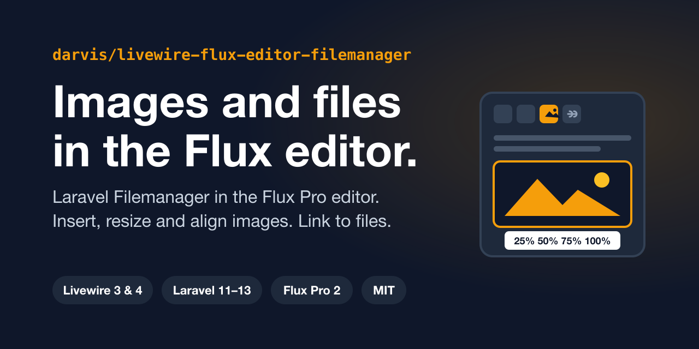

# Flux Editor Filemanager

**Laravel Filemanager** inside the **Flux Pro editor**. Two toolbar buttons open the file manager in a popup to insert images and file links. Images get a resize and align menu and an edit modal, and image files can be dropped on the editor or pasted from the clipboard.



```bash
composer require darvis/livewire-flux-editor-filemanager
php artisan flux-filemanager:install
```

Requires PHP 8.2+, Laravel 11, 12 or 13, Livewire 3 or 4, Flux Pro 2 and Laravel Filemanager 2.

## Use it

```blade
<flux:field>
    <flux:label>Content</flux:label>
    <x-flux-filemanager-editor wire:model="content" />
    <flux:error name="content" />
</flux:field>
```

The component wraps `<flux:editor>` with a toolbar preset (`default`, `minimal`, `full`, or your own with `:toolbar="false"`) and passes every other attribute through. The content is plain HTML that you render as you would any editor output.

## What you get

- An image button and a file link button that open Laravel Filemanager in a popup, for every Flux editor on the page
- Single click on an image for the resize menu, double click for the edit modal with alt text, title, width, alignment, classes and styles
- A link modal for file links with text, target, classes and styles; click a link to edit it
- Drag and drop and paste of image files, embedded as base64 or uploaded to Laravel Filemanager
- Clean HTML: `` and `<a>` tags with attributes, no shortcodes
- English, Dutch and German, also in the JavaScript modals
- An installer that sets up Laravel Filemanager, the npm packages and your `app.js`
- A Laravel Boost guideline and skill for AI assistants working in your app

## Read next

- [Installation](installation.md): the installer, what it does, and the manual steps
- [Your first editor](first-editor.md): a complete example, from migration to published page, and the three things that usually go wrong
- [Configuration](configuration.md): every option in `config/flux-filemanager.php`
- [Image editing](image-editing.md): the resize menu, the edit modal and the HTML they produce
- [File links](file-links.md): insert and edit links to files
- [Drag and drop](drag-and-drop.md): base64 or upload, limits, and what to check when it doesn't work
- [Localization](localization.md)
- [How it works](how-it-works.md): the JavaScript contract, for debugging and extending
- [FAQ](faq.md)
